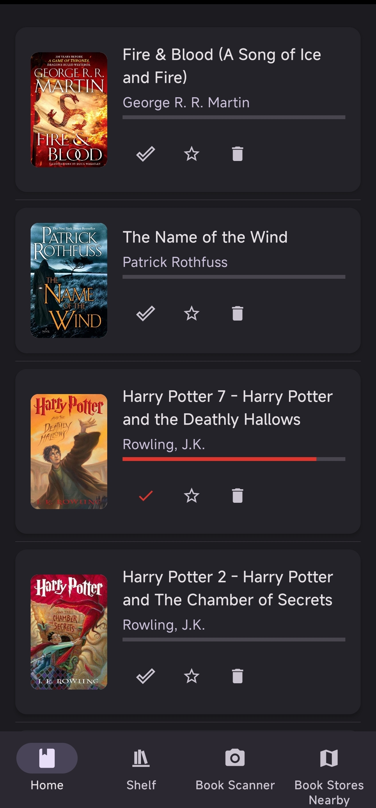
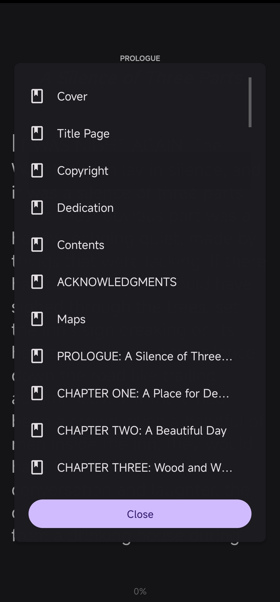
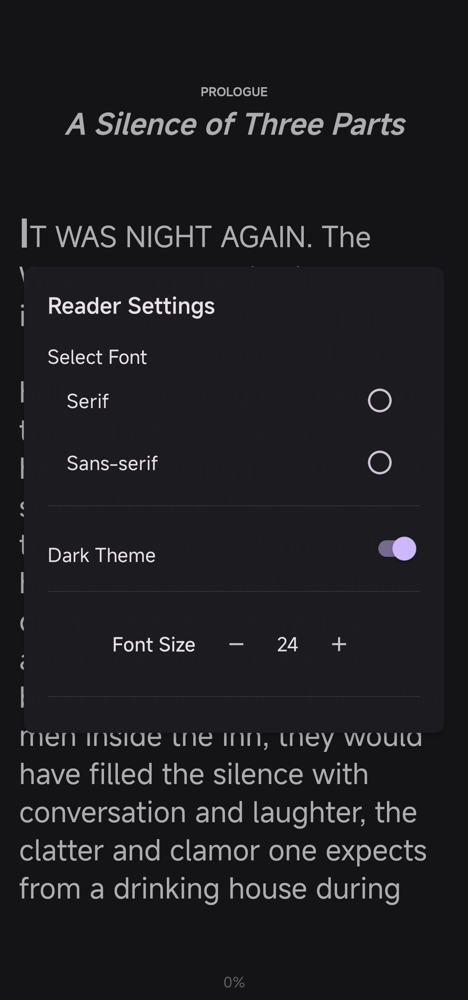
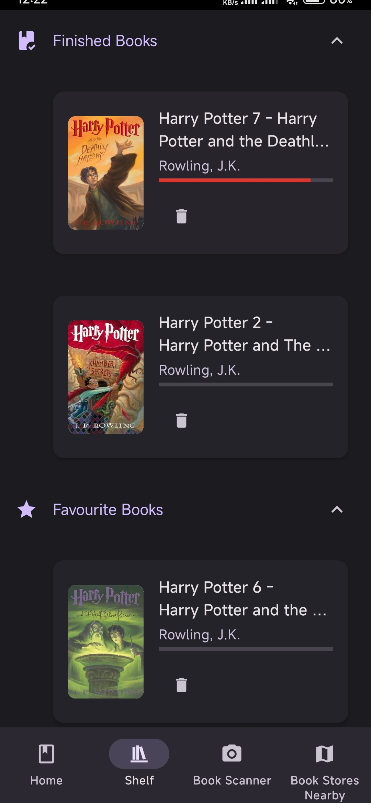
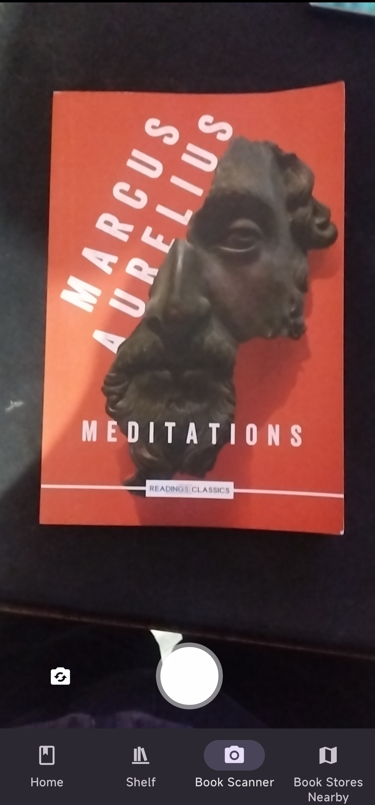
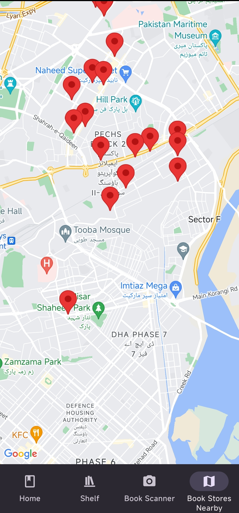

# BookSpace

**BookSpace** is a highly efficient e-reader app that leverages `epubjs-react-native` to seamlessly read EPUB files. With a user-friendly interface and multiple features, BookSpace is designed to enhance your reading experience.

---

## Features

### 1. Homepage and Reader Screen





The homepage displays all the available books in your selected directory, allowing you to easily browse through your collection. 
The reader screen allows you to read through you book using swipe right and left gestures. Using the swipe up and down gestures brings up the chapter selection and the settings menu.

---

### 2. Shelf


The Shelf page organizes your books into **Favorites** and **Finished** categories. Users can add books to the shelf directly from the homepage for easy access.

---

### 3. Book Scanner



The Book Scanner uses **React Native Vision** to capture images of books through the camera. It then utilizes **Google Vision OCR** for text extraction and fetches detailed book information from the **OpenLibrary API**.

---

### 4. Nearby Bookstores


BookSpace fetches the user's location to display nearby bookstores, helping you discover places to purchase physical copies of books.

---

BookSpace combines convenience, functionality, and advanced technology to provide an exceptional reading experience. Download now and explore the world of books!

# Getting Started with the React Native Project

This guide provides step-by-step instructions to clone, set up, and run a React Native project.

---

## Step 1: Clone the Project

To get started, clone the React Native project repository using the following command:

```bash
git clone <repository-url>
```

Replace `<repository-url>` with the actual URL of the Git repository.

Navigate to the project's root directory:

```bash
cd <project-folder>
```

---

## Step 2: Install Dependencies

Install the necessary dependencies for the project:

```bash
# Using npm
npm install

# OR using Yarn
yarn install
```

This command downloads and sets up all required libraries and modules.

---

## Step 3: Set Up Environment Variables

If the project uses a `.env` file for managing environment-specific configurations:

1. Create a `.env` file in the root directory.
2. If an example file is provided, copy it:

   ```bash
   cp .env.example .env
   ```

3. Update the `.env` file with the correct environment-specific values.

---

## Step 4: Start the Metro Server

Metro is the JavaScript bundler that compiles and serves your React Native project. Start the Metro server with the following command:

```bash
# Using npm
npm start

# OR using Yarn
yarn start
```

Let Metro Bundler run in its own terminal. Do not close this terminal while running the app.

---

## Step 5: Launch the App

Open a new terminal and run the app on your desired platform.

### For Android:

```bash
# Using npm
npm run android

# OR using Yarn
yarn android
```

Ensure:
- An Android emulator is running, or a physical Android device is connected with USB debugging enabled.
- Android Studio is installed and properly configured.

### For iOS:

```bash
# Using npm
npm run ios

# OR using Yarn
yarn ios
```

Ensure:
- Xcode is installed on your Mac.
- The iOS Simulator is set up, or a physical iOS device is connected.

---

## Step 6: Verify and Modify

Once the app is running:

1. Verify it works as expected.
2. To make changes, edit the `App.tsx` or any other relevant source file.
3. Use hot reloading to see changes instantly:
   - **Android**: Press <kbd>R</kbd> twice or open the Developer Menu (<kbd>Ctrl</kbd>/<kbd>Cmd</kbd> + <kbd>M</kbd>).
   - **iOS**: Press <kbd>Cmd</kbd> + <kbd>R</kbd> in the iOS Simulator.

---

## Step 7: Debugging and Troubleshooting

If you encounter issues, follow these steps:
- Check the Metro Bundler terminal for error messages.
- Restart Metro Bundler with:

  ```bash
  npm start --reset-cache
  # OR
  yarn start --reset-cache
  ```

- Refer to the [React Native Troubleshooting Guide](https://reactnative.dev/docs/troubleshooting).

---

With these steps, you should be able to successfully clone, set up, and run the React Native project. 🎉
